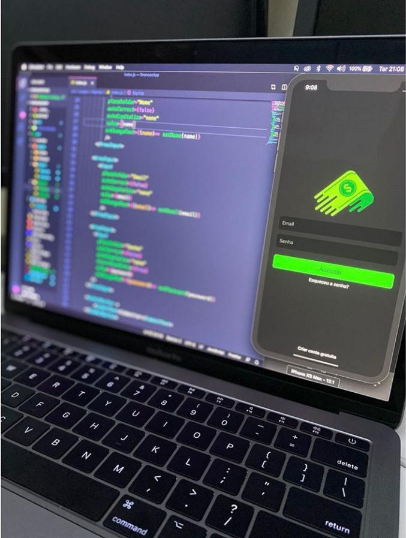

### Projeto Finaças React Native

<p aligin="center">
    
</p>

---


### Dependências

<p><i>Instale os pacotes necessários em seu projeto React Native:</i></p>

<p>Este projeto é conectado com o firebase, então o primeiro passo é criar uma conta no firebase para realiizar as configurações.</p>

``` npm install --save firebase ```

<p>Agora com o firebase instalado podemos instalar o Async Storage com o comando:</p>

``` yarn add '@react-native-community/async-storage  ```

<p>Agora precisamos configurar nossa navegação:</p>


``` yarn add @react-navigation/native ```

<p><i>Instalação de dependências em um projeto React Native vazio</i></p>
<p>No diretório do seu projeto, execute:</p>
 
 ``` yarn add react-native-reanimated react-native-gesture-handler react-native-screens react-native-safe-area-context @react-native-community/masked-view ```

 <p><i>Instalando a biblioteca Stack Navigator</i></p>

 ``` yarn add @react-navigation/stack ```


<p><i>Instalando a biblioteca Drawer navigation</i></p>

``` yarn add @react-navigation/drawer ```
 

<p><b>Reinicie seu emulador</b> e agora em qualquer componente você pode utilizar o pacote de fontes que preferir utilizando o componente <b>Icon</b></p>

```